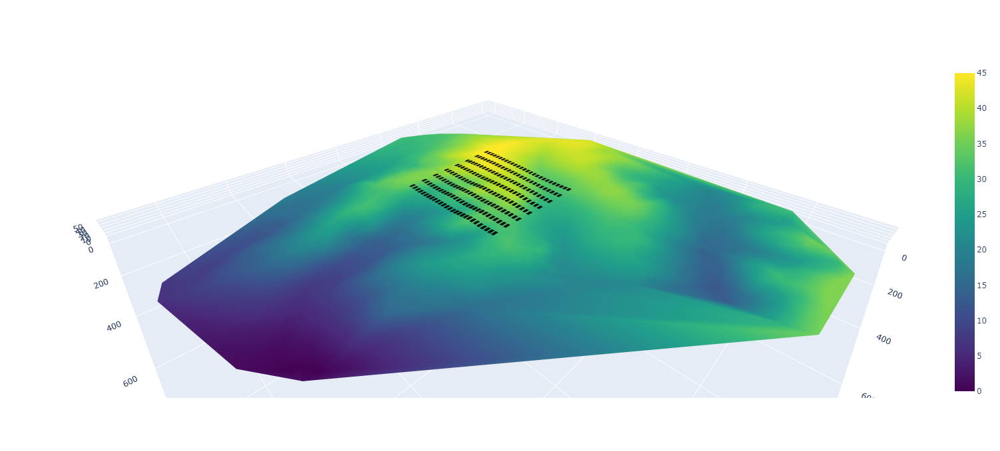

# Geomesh: A Python Toolkit for Photovoltaic Park Simulation and Visualization

"Geomesh" is a comprehensive Python project that integrates geometric analysis, mesh generation, interpolation techniques, and rendering capabilities to simulate and visualize photovoltaic parks on various terrains. The project begins with exploring the geometric properties of triangles, essential for understanding the topology of the terrain. Leveraging Delaunay triangulation, it constructs a mesh from a given point cloud, enabling representation of the terrain surface. Through 2D NDI interpolation, the mesh quality is enhanced, ensuring accuracy in representing the terrain's features. The final stage involves rendering photovoltaic modules onto the topography, providing a realistic visualization of how the solar panels would look on the landscape. "Geomesh" offers a powerful toolkit for engineers and planners to simulate and visualize photovoltaic parks, aiding in decision-making processes and optimizing the design of renewable energy installations

Below is a snippet showcasing a simulation of the solar plant, meticulously crafted using Plotly, a powerful visualization library integrated into this project. [link](https://htmlpreview.github.io/?https://github.com/pedrodamas1/PV-Topography/blob/main/data/render.htm).



The Python libraries leveraged in this project included:

```python
import plotly
import scipy
import pandas as pd
import numpy as np
import matplotlib.pyplot as plt
```
